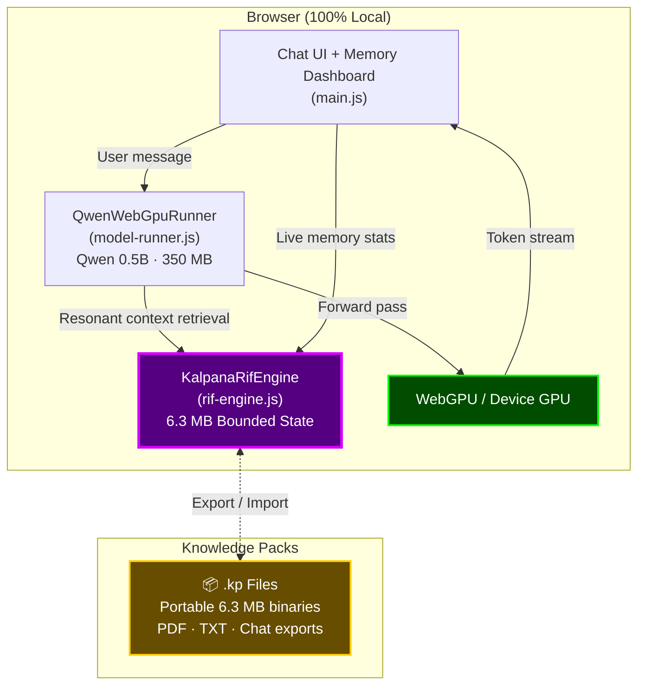

# 🔮 Kalpanā AI — On-Device AI with Bounded Memory

**Run a full AI chat with 3-million-token memory in just 6.3 MB — 100% locally in your browser.**

[](https://madushaperera-gif.github.io/Kalpana-Ai/)
[](https://github.com/madushaperera-gif/Kalpana-Ai)
[](LICENSE.md)

> **Kalpanā** is a physics-derived AI engine that replaces the standard KV-Cache memory system with **Resonant Interference Fields (RIF)** — achieving O(1) constant memory regardless of conversation length. This app runs **Qwen 0.5B entirely on your device** via WebGPU, with zero cloud API calls, zero data leaving your browser.

---

## ⚡ Try It Now

**[→ Launch Kalpanā AI](https://madushaperera-gif.github.io/Kalpana-Ai/)**

Works on Chrome, Edge, Safari (desktop & mobile). No installation. No sign-up. No cloud.

---

## 🧠 What Makes This Different

Every AI chatbot today stores your conversation in a **KV-Cache** that grows linearly — the longer you chat, the more memory it eats, until it crashes or forgets.

Kalpanā takes a fundamentally different approach: a **physics-derived external memory layer** (Resonant Interference Fields) that compiles the full conversation history into a **fixed-size bounded state** — regardless of how long the context grows.

| | Standard KV-Cache | Kalpanā RIF Engine |
|---|---|---|
| **Memory scaling** | O(N) — grows with every token | **O(1) — constant, always 6.3 MB** |
| **At 3M tokens** | ~1,450 MB+ (crashes most devices) | **6.3 MB** (runs on a phone) |
| **RAM saved** | — | **99.6%** |
| **Context window** | Limited by available memory | **3,000,000 tokens** |
| **Cloud dependency** | Usually required | **None — runs 100% locally** |

---

## 🏗️ Architecture



**How a message flows:**

1. User sends a message → `main.js` passes it to `QwenWebGpuRunner`
2. If a Knowledge Pack is loaded, the RIF Engine performs **resonant phase retrieval** to extract the most relevant context — in constant time, from up to 3M tokens
3. The prompt (system + RIF context + user query) is sent to **Qwen 0.5B running locally via WebGPU**
4. Tokens stream back to the chat UI in real-time
5. The Memory Dashboard updates live, showing O(1) vs O(N) comparison

**Zero data leaves your device. Ever.**

---

## 📦 Knowledge Packs (.kp)

Knowledge Packs are portable, fixed-size binary files that capture an entire context — documents, chat history, domain knowledge — into a **6.3 MB bounded state**.

| Feature | Details |
|---|---|
| **Compile from** | PDF files, TXT files, or live chat sessions |
| **Size** | Always 6.3 MB (regardless of source size) |
| **Token capacity** | Up to 3,000,000 tokens |
| **Portable** | Drag-and-drop into any Kalpanā instance |
| **Offline** | Works completely offline once loaded |

```
.kp File Structure:
├── Header (2 KB)  — JSON metadata (title, token count, bandwidth, model, timestamp)
└── Body (6.3 MB)  — RIF holographic state (state_re + state_im)
```

---

## 🔧 Run Locally

```bash
# Clone the repo
git clone https://github.com/madushaperera-gif/Kalpana-Ai.git
cd Kalpana-Ai

# Install dependencies
npm install

# Start dev server
npm run dev
```

Open `http://localhost:5173` in a WebGPU-capable browser (Chrome 113+, Edge 113+, Safari 18+).

### Build & Deploy

```bash
# Build for production
npm run build

# Deploy to GitHub Pages
npm run deploy
```

---

## 📁 Project Structure

```
Kalpana-Ai/
├── index.html                 ← App entry point
├── vite.config.js             ← Vite build configuration
├── package.json               ← Dependencies & scripts
├── src/
│   ├── main.js                ← Chat UI, memory dashboard, KP compiler
│   ├── model-runner.js        ← Qwen 0.5B WebGPU inference engine
│   ├── rif-engine.js          ← RIF core (bounded memory, KP export/import)
│   ├── base64-assets.js       ← Embedded icons & visual assets
│   └── style.css              ← Dark theme, responsive layout
├── public/                    ← Static assets
└── dist/                      ← Production build output
```

---

## 🛠️ Tech Stack

| Layer | Technology |
|---|---|
| **Framework** | Vite (vanilla JS, no React/Vue) |
| **AI Model** | Qwen 1.5 0.5B Chat (INT4 quantized) |
| **Inference** | WebGPU + `@mlc-ai/web-llm` |
| **Memory Engine** | Kalpanā RIF (Resonant Interference Fields) |
| **Deployment** | GitHub Pages (static SPA) |
| **Offline** | PWA-ready, zero cloud dependency |

---

## 📊 Runtime Memory Footprint

| Component | RAM |
|---|---|
| Qwen 0.5B Model Weights (INT4) | 350.0 MB |
| Kalpanā RIF State (3M token capacity) | 6.3 MB |
| **Total App Footprint** | **356.3 MB** |
| Standard KV-Cache equivalent at 3M tokens | 1,450+ MB |
| **Memory Saved** | **99.6%** |

---

## 🔬 The Science: Resonant Interference Fields

Kalpanā's memory engine is based on **Resonant Interference Fields (RIF)** — a mathematical framework derived from quantum interference theory and Euler phase projections.

Instead of storing individual tokens in a growing cache, RIF projects Key and Value tensors into a **fixed-size frequency spectrum** using complex Euler coordinates (S_re + i·S_im). Context is reconstructed via **temporal frequency sweeps** — the same mathematical principles that underpin holography and Fourier transforms.

The result: memory stays **constant at 6.3 MB** whether you've processed 1,000 tokens or 3,000,000.

> 📄 **Patent:** International PCT Application Pending  
> 📄 **Patent (Sri Lanka):** LK/P/1/24089

---

## 🏢 About

**Kalpanā** is built by **[Vijñāna AI (PVT) LTD](https://kalpana-vijnana.web.app)** — a deep-tech AI infrastructure company based in Sri Lanka, building the bounded-memory layer for the next generation of AI systems.

- 🌐 **Website:** [kalpana-vijnana.web.app](https://kalpana-vijnana.web.app)
- 📧 **Contact:** support@vijñānaai.com
- 🔬 **SDK & Enterprise:** [Kalpanā Engine SDK](https://github.com/madushaperera-gif/Kalpana-Engine-SDK)

---

<p align="center">
  <em>Kalpanā: Bounded Memory. Infinite Context. Zero Cloud.</em>
</p>
