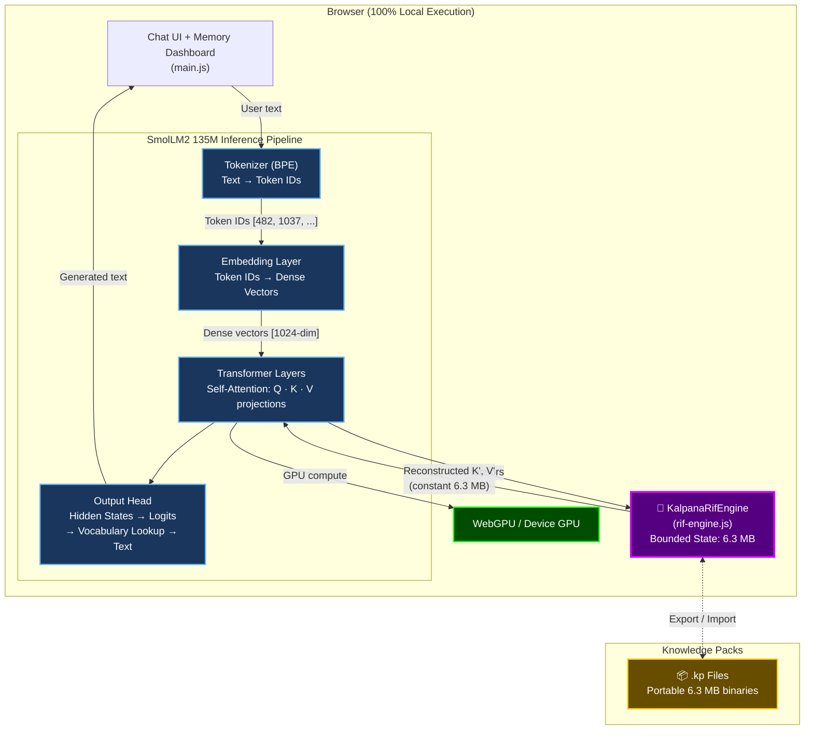
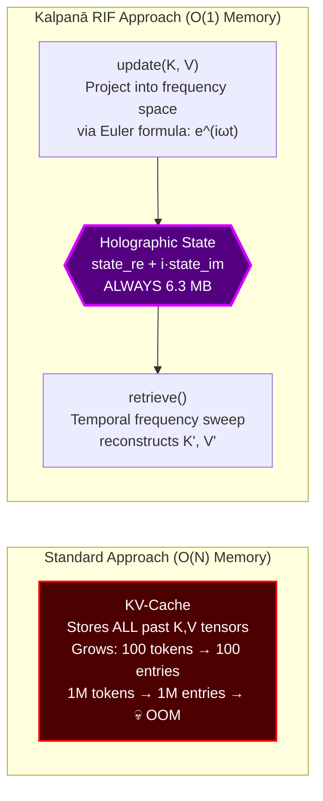
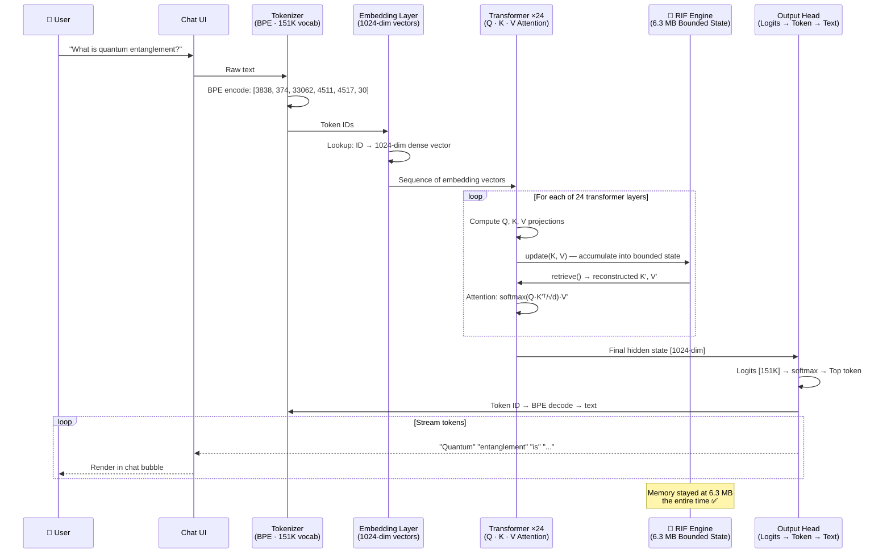

# 🔮 Kalpanā AI — On-Device AI with Bounded Memory

**Run a full AI chat with 3-million-token memory in just 6.3 MB — 100% locally in your browser.**

[](https://madushaperera-gif.github.io/Kalpana-Ai/)
[](https://github.com/madushaperera-gif/Kalpana-Ai)
[](LICENSE.md)

> **Kalpanā** is a physics-derived AI engine that replaces the standard KV-Cache memory system with **Resonant Interference Fields (RIF)** — achieving O(1) constant memory regardless of conversation length. This app runs **SmolLM2 135M entirely on your device** via WebGPU (ultra-lightweight ~90 MB footprint), with zero cloud API calls, zero data leaving your browser.

---

## ⚡ Try It Now

**[→ Launch Kalpanā AI](https://madushaperera-gif.github.io/Kalpana-Ai/)**

Works on Chrome, Edge, Safari (desktop & mobile). No installation. No sign-up. No cloud.

---

## 🧠 What Makes This Different

Every AI chatbot today stores your conversation in a **KV-Cache** that grows linearly — the longer you chat, the more memory it eats, until it crashes or forgets.

Kalpanā takes a fundamentally different approach: a **physics-derived external memory layer** (Resonant Interference Fields) that compiles the full conversation history into a **fixed-size bounded state** — regardless of how long the context grows.

| | Standard KV-Cache | Kalpanā RIF Engine |
|---|---|---|
| **Memory scaling** | O(N) — grows with every token | **O(1) — constant, always 6.3 MB** |
| **At 3M tokens** | ~1,450 MB+ (crashes most devices) | **6.3 MB** (runs on a phone) |
| **RAM saved** | — | **99.6%** |
| **Context window** | Limited by available memory | **3,000,000 tokens** |
| **Cloud dependency** | Usually required | **None — runs 100% locally** |

---

## 🏗️ System Architecture



---

## 🔬 How the Pipeline Works

Understanding how text flows through Kalpanā requires understanding the five core stages of the inference pipeline and where RIF replaces the standard memory system.

### Stage 1: Tokenizer (BPE)

The **Byte-Pair Encoding (BPE) tokenizer** converts raw text into a sequence of integer **token IDs** using Qwen's ~151K-entry vocabulary dictionary.

```
Input:  "What is quantum entanglement?"
Output: [3838, 374, 33062, 4511, 4517, 30]
```

- Each word or subword maps to a unique ID in the vocabulary
- The vocabulary is a fixed dictionary — it doesn't change during inference
- Qwen's tokenizer handles multilingual text (English, Chinese, code, etc.)
- This step is pure lookup — no neural computation, no GPU needed

### Stage 2: Embedding Layer

The **embedding layer** converts each integer token ID into a **dense vector** (a list of 1,024 floating-point numbers). This is where tokens gain "meaning."

```
Token ID 33062 ("quantum") → [0.023, -0.841, 0.192, ..., 0.447]  (1024 dims)
```

- The embedding matrix is a learned lookup table: `vocab_size × embedding_dim` (151K × 1024)
- Each token ID indexes one row of this matrix
- The output is a sequence of dense vectors representing the input semantically
- These vectors carry positional and semantic information the transformer layers can process

### Stage 3: Transformer Attention Layers (×24)

This is the core computation. Qwen 0.5B has **24 transformer layers**, each with **16 attention heads**. Every layer:

1. Projects the input into three matrices: **Query (Q)**, **Key (K)**, and **Value (V)**
2. Computes attention: `Attention = softmax(Q · Kᵀ / √d) · V`
3. The K and V tensors represent the model's "memory" of past tokens

**In standard transformers**, K and V are stored in a **KV-Cache** that grows with every new token — this is the memory bottleneck.

### Stage 4: 🔮 RIF — Where Kalpanā Replaces the KV-Cache

**This is where Kalpanā fundamentally differs.** Instead of storing K and V in a growing linear cache:



The RIF engine:
- **`update(K, V)`** — Projects each new Key and Value tensor into a fixed-size frequency spectrum using complex Euler coordinates (S_re + i·S_im). The state **accumulates** information without growing.
- **`retrieve()`** — Reconstructs approximate K' and V' via a **temporal frequency sweep** — the same principles that underpin holography and Fourier transforms.
- **Result:** Memory stays at **6.3 MB** whether you've processed 1,000 tokens or 3,000,000.

### Stage 5: Output Head (Logits → Text)

The final transformer layer outputs a **hidden state vector** which is multiplied against the vocabulary embedding matrix to produce **logits** — a score for every token in the ~151K vocabulary.

```
Hidden state [1024-dim] × Embedding Matrix [1024 × 151K] → Logits [151K scores]
    → softmax → Token ID 4511 → Vocabulary lookup → "entanglement"
```

The tokenizer's vocabulary dictionary is used in reverse: token ID → text. Tokens stream back to the UI one at a time for real-time generation.

---

## 🔄 Full Inference Flow



---

## 📦 Knowledge Packs (.kp)

Knowledge Packs are portable, fixed-size binary files that capture an entire context — documents, chat history, domain knowledge — into a **6.3 MB bounded state**.

| Feature | Details |
|---|---|
| **Compile from** | PDF files, TXT files, or live chat sessions |
| **Size** | Always 6.3 MB (regardless of source size) |
| **Token capacity** | Up to 3,000,000 tokens |
| **Portable** | Drag-and-drop into any Kalpanā instance |
| **Offline** | Works completely offline once loaded |

```
.kp File Structure:
├── Header (2 KB)  — JSON metadata (title, token count, bandwidth, model, timestamp)
└── Body (6.3 MB)  — RIF holographic state (state_re + state_im)
```

When a Knowledge Pack is loaded, the RIF Engine performs **resonant context retrieval** to extract the most relevant context for each user query — in constant time, from up to 3M tokens of compiled knowledge.

---

## 🔧 Run Locally

```bash
# Clone the repo
git clone https://github.com/madushaperera-gif/Kalpana-Ai.git
cd Kalpana-Ai

# Install dependencies
npm install

# Start dev server
npm run dev
```

Open `http://localhost:5173` in a WebGPU-capable browser (Chrome 113+, Edge 113+, Safari 18+).

### Build & Deploy

```bash
# Build for production
npm run build

# Deploy to GitHub Pages
npm run deploy
```

---

## 📁 Project Structure

```
Kalpana-Ai/
├── index.html                 ← App entry point
├── vite.config.js             ← Vite build configuration
├── package.json               ← Dependencies & scripts
├── src/
│   ├── main.js                ← Chat UI, memory dashboard, KP compiler
│   ├── model-runner.js        ← Qwen 0.5B WebGPU inference engine
│   ├── rif-engine.js          ← RIF core (bounded memory, KP export/import)
│   ├── base64-assets.js       ← Embedded icons & visual assets
│   └── style.css              ← Dark theme, responsive layout
├── public/                    ← Static assets
└── dist/                      ← Production build output
```

### How the source files connect:

| File | Role | Connects to |
|---|---|---|
| **main.js** | Chat UI, memory dashboard, user interactions | Calls `model-runner.js` and `rif-engine.js` |
| **model-runner.js** | Loads SmolLM2 135M, runs inference via WebGPU | Uses `rif-engine.js` for context retrieval |
| **rif-engine.js** | RIF core: bounded memory, KP compile/export | Called by `model-runner.js` during inference |
| **base64-assets.js** | Embedded icons and media | Imported by `main.js` |
| **style.css** | Dark theme, responsive layout | Loaded by `index.html` |

---

## 🛠️ Tech Stack

| Layer | Technology |
|---|---|
| **Framework** | Vite (vanilla JS, no React/Vue) |
| **AI Model** | SmolLM2 135M Instruct (Ultra-lightweight for mobile WebGPU) |
| **Inference** | WebGPU + `@mlc-ai/web-llm` |
| **Tokenizer** | BPE (Byte-Pair Encoding) |
| **Memory Engine** | Kalpanā RIF (Resonant Interference Fields) — O(1) bounded state |
| **Deployment** | GitHub Pages (static SPA) |
| **Offline** | PWA-ready, zero cloud dependency |

---

## 📊 Runtime Memory Footprint

| Component | RAM |
|---|---|
| SmolLM2 135M Model Weights | 90.0 MB |
| Kalpanā RIF State (3M token capacity) | 6.3 MB |
| **Total App Footprint** | **~96.3 MB** |
| Standard KV-Cache equivalent at 3M tokens | 1,450+ MB |
| **Memory Saved** | **99.6%** |

---

## 🔬 The Science: Resonant Interference Fields

Kalpanā's memory engine is based on **Resonant Interference Fields (RIF)** — a mathematical framework derived from quantum interference theory and Euler projections.

Instead of storing individual tokens in a growing cache, RIF projects Key and Value tensors into a **fixed-size frequency spectrum** using complex Euler coordinates (S_re + i·S_im). Context is reconstructed via **temporal frequency sweeps** — the same mathematical principles that underpin holography and Fourier transforms.

The result: memory stays **constant at 6.3 MB** whether you've processed 1,000 tokens or 3,000,000.

### Why This Matters for the Pipeline

In a standard transformer, the bottleneck is **between the attention layers and the KV-Cache**. The tokenizer, embedder, and output head are all fixed-cost operations. It's only the KV-Cache that grows without bound.

By replacing **only the KV-Cache** with RIF, Kalpanā keeps every other component (tokenizer, embedder, transformer weights, output head) exactly the same — while eliminating the only part that causes memory to explode.

> 📄 **Patent:** International PCT Application Pending  
> 📄 **Patent (Sri Lanka):** LK/P/1/24089

---

## 🏢 About

**Kalpanā** is built by **[Vijñāna AI (PVT) LTD](https://kalpana-vijnana.web.app)** — a deep-tech AI infrastructure company based in Sri Lanka, building the bounded-memory layer for the next generation of AI systems.

- 🌐 **Website:** [kalpana-vijnana.web.app](https://kalpana-vijnana.web.app)
- 📧 **Contact:** support@vijñānaai.com
- 🔬 **SDK & Enterprise:** [Kalpanā Engine SDK](https://github.com/madushaperera-gif/Kalpana-Engine-SDK)

---

<p align="center">
  <em>Kalpanā: Bounded Memory. Infinite Context. Zero Cloud.</em>
</p>
